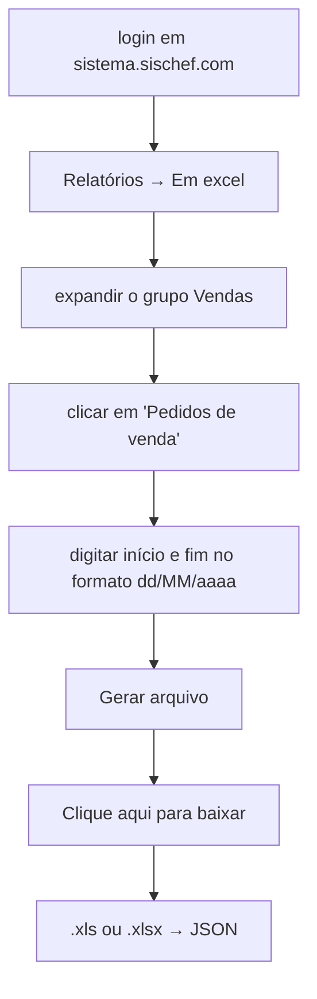

# Como funciona

## O caminho no Sischef

O crawler refaz, em ~1 minuto, o que era feito à mão todo dia:

Duas armadilhas que já custaram caro e estão resolvidas no código:

- **O grupo "Vendas" vem fechado.** O link do relatório não existe no DOM antes de
  expandir o acordeão. Ir direto na URL de exportação não basta.
- **`--no-sandbox` não basta na Lambda.** O processo *zygote* do Chromium tenta criar
  user namespaces, que a Lambda proíbe, e morre com `credentials.cc: Operation not
  permitted` + SEGV — que chega no Playwright disfarçado de `Assertion error`.
  `--no-zygote` é o que resolve. Funciona no Docker local e falha na Lambda, então
  é o tipo de coisa que só o deploy revela.
- **`Escape` apaga a data.** O campo é um PrimeFaces Calendar (jQuery UI por baixo),
  onde ESC significa *cancelar* e devolve o campo ao valor anterior. Sai-se do campo
  com **Tab**.

## As peças

| Pasta | O que faz |
|---|---|
| `packages/sischef/src/seletores.ts` | **o único arquivo que conhece o HTML do Sischef** |
| `packages/sischef/src/fluxo/` | um passo por arquivo: login, abrir, preencher, baixar |
| `packages/sischef/src/parsers/` | `.xls` (BIFF) e `.xlsx` → JSON, com validação de layout |
| `packages/shared/` | contratos zod do pedido e da resposta |
| `apps/api/` | a Lambda: confere a chave, chama o crawler, sobe no S3, responde |

## Quando o Sischef mudar a tela

1. `npm run gravar` e refaça o percurso.
2. Abra `packages/sischef/gravacoes/fluxo.js` e transplante os seletores que mudaram
   para `seletores.ts`. **Só isso** — o resto do código não conhece a tela.
3. `npm run baixar -- --inicio AAAA-MM-DD --fim AAAA-MM-DD --ver` para conferir.

A gravação guarda a senha digitada e um cookie de sessão válido; `gravacoes/` está no
`.gitignore` e deve ser apagada depois.

## O formato do arquivo

O Sischef **alterna entre `.xls` (BIFF antigo) e `.xlsx`** sem avisar — o
`CLAUDE.md` da Logística Diária já documentava isso. O parser decide pelo conteúdo,
não pela extensão.

Uma armadilha do `.xls`: os IDs são célula numérica, e a formatação da planilha os
entrega como `"159,351,578"` (separador de milhar americano), que um parser pt-BR lê
errado. Por isso a leitura é `raw` e a conversão é por coluna. Há teste de regressão.
